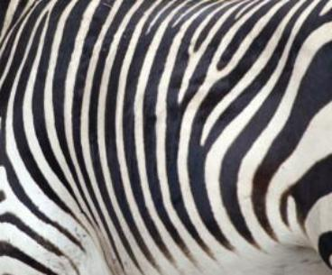
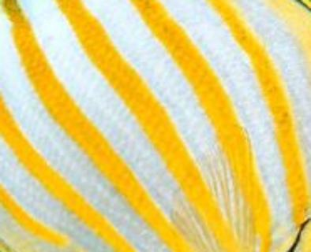
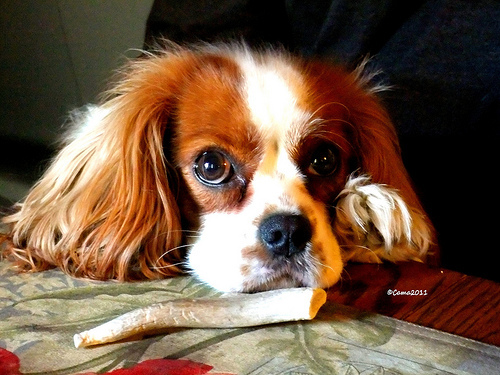
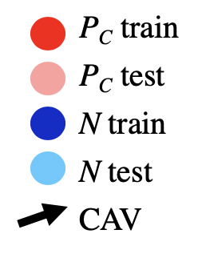
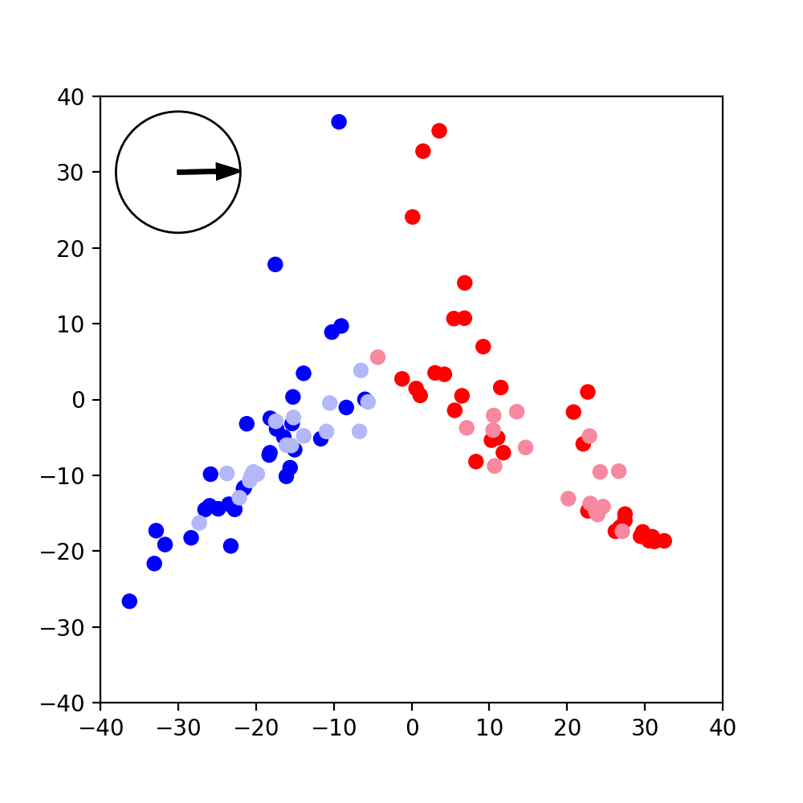
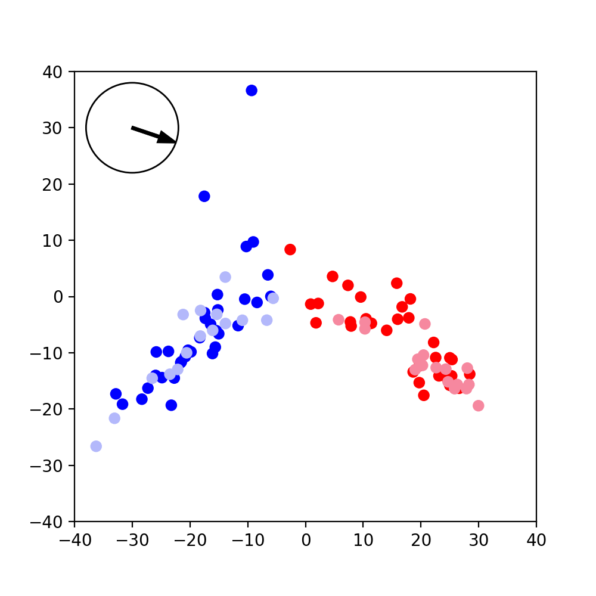
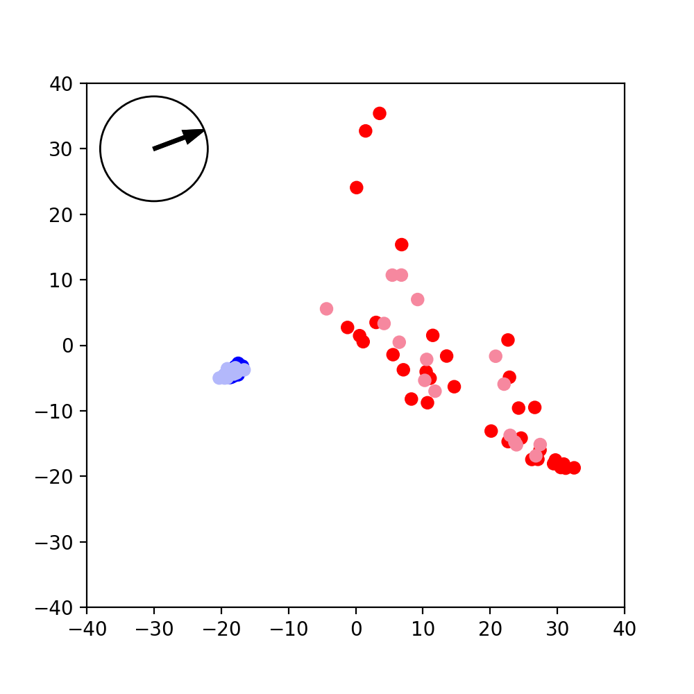

## Description
This repo contains some of my dissertation work for the MPhil in Machine Learning at the University of Cambridge. I'm working on Interpretable Machine Learning. The original repo is from [TCAV](https://github.com/tensorflow/tcav). This is currently a work in progress!

## Visualizing CAVs
CAVs, or concept activation vectors are trained using example images that contain a particular concept of interest. Below are some example concepts for the *striped* concept class.

To learn the concept, a set of *random images* (from ImageNet) are used in a binary classfication task. The data for the classification is the activations for each images in a given layer in a neural net.

The CAV is normal to the hyperplane that separates these two classes, learned through a linear classifier. Part of my work is visualizing the two classes and learned CAV. In other words, it should point "towards" the concept class. Through PCA, I have visualized CAVs under several conditions.

CAVs can be learned from the activations of any layer in a given network. For this example, I'm using the "mixed9" layer of InceptionV3, trained for ImageNet. The CAV is also reduced to 2 dimensions using the same PCA embedding. It is normalized and shown in the top left of each plot.

In the plot below, red points are from the concept (Pc), and blue are negative examples (N), which are random images. The CAV points from the blue to the red, as we would hope.

A similar CAV is leared using a different set of the same (striped) concept.

Using random noise instead of random images from ImageNet, the "spread" of the negative class decreases significantly, as seen in the PCA embedding. This has an impact on the CAV too.

This work is from `analyze_cavs_azure.ipynb` although this notebook is still a work in progress.

## Other work
Below are a few more work directions for my dissertation
* Using [DeepDream](https://github.com/google/deepdream) to visualize the learned concepts
* Finding the prototyipcal example image of a CAV through sorting
* Finding conditions under which a very similar CAV will be learned
* Training CAVs through different methods and observing the impact on learned concepts

